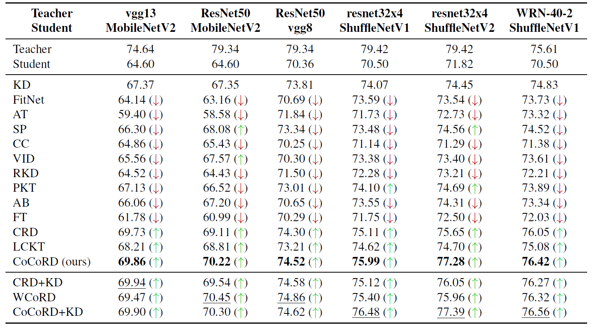

# Contrastive Consistent Representation Distillation

This repository is PyTorch code for our proposed CoCoRD.


The illustration of our proposed CoCoRD. The task-specific loss (e.g. classification loss) is omitted for clear presentation. The details about our proposed CoCoRD can be found in our main paper.

## Contents
1. [Requirements](#Requirements)
2. [Train](#Train)
3. [Results](#Results)
4. [Citation](#Citation)
5. [Acknowledgements](#Acknowledgements)

## Requirements
- Python 3 (Tested with Python 3.10)
- PyTorch (Tested with PyTorch 2.0, should be runnable with PyTorch 1.x)
- tensorboard (pip install tensorboard)
- PyYAML (pip install PyYAML)


## Train
1. Fetch the pretrained teacher models provided by [CRD](https://github.com/HobbitLong/RepDistiller).
2. Modify `./options/train_student.yml` for your needs. The hyperparameters are explained in the yaml file.
3. Run CoCoRD distillation with the following command:
    ```
   python main.py -opt ./options/train_student.yml -t 1
   ```
   where the flags are explained as:
    - `-opt`: specify the path to the training yaml file.
    - `-t`: specify the experimental id to differentiate between multiple runs.  
   
4. You can monitor the distillation process in `./experiments`.

Note: this code is for a single-gpu training on CIFAR-100 dataset. The dataset will be automatically downloaded.

## Results
The performance is measured by Top-1 classification accuracy (%).

The red arrow denotes underperforming KD. The green arrow denotes outperforming KD.

1. Teacher and student are of the **same** architectural style.

    

2. Teacher and student are of the **different** architectural style.

    

## Citation
If you find our work useful for your research, please consider citing the paper

```letex
@inproceedings{CoCoRD_Fu_bmvc23,
  author       = {Shipeng Fu and Haoran Yang and Xiaomin Yang},
  title        = {Contrastive Consistent Representation Distillation},
  booktitle    = {34th British Machine Vision Conference 2023, {BMVC} 2023},
  pages        = {300--303},
  publisher    = {{BMVA} Press},
  year         = {2023},
}
```

For any questions, please contact Shipeng Fu (fushipeng97@gmail.com).

## Acknowledgements

- Thanks to [Haoran Yang](https://github.com/Rookie12580) for helping develop this repository.
- Thanks to the authors of [RepDistiller](https://github.com/HobbitLong/RepDistiller). They provide many useful codes which facilitate our work.
- Thanks also go to authors who make their code publicly available.
